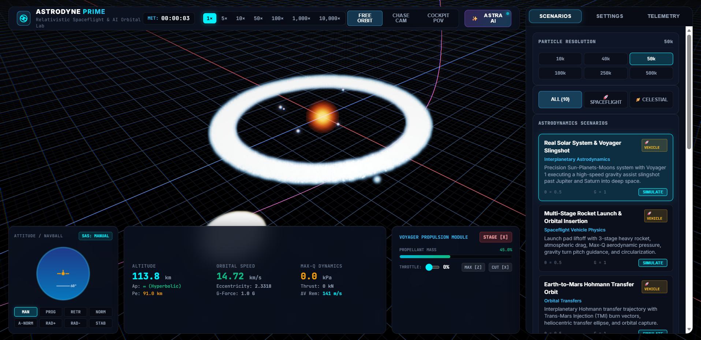
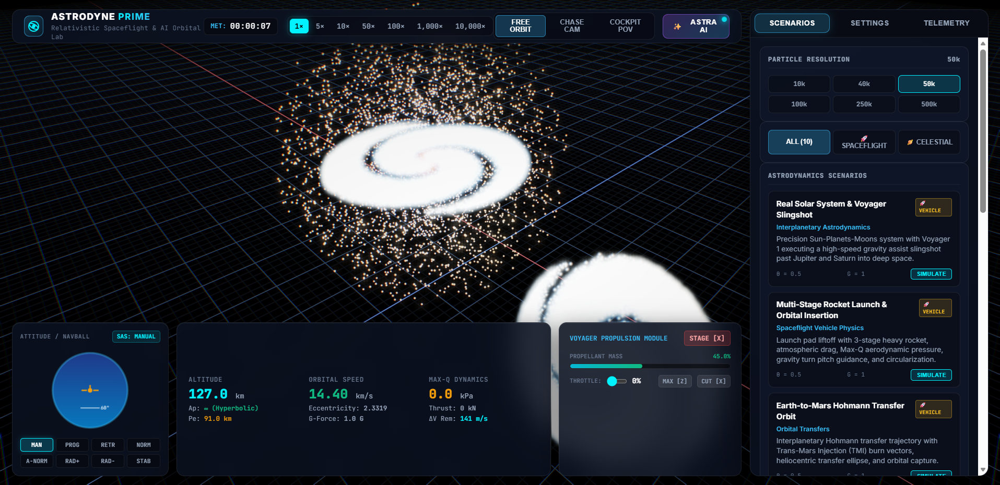
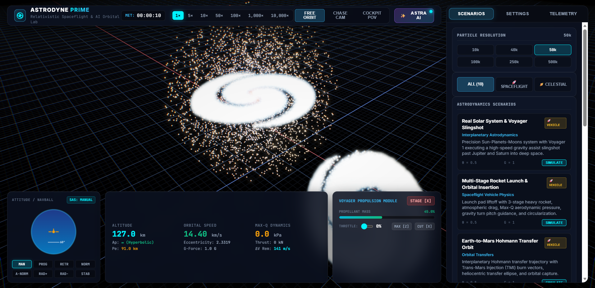

# ASTRODYNE PRIME: WebGPU Spaceflight & AI Astrodynamics Simulator

[](https://www.w3.org/TR/webgpu/)
[](https://www.typescriptlang.org/)
[](https://vitejs.dev/)
[](https://ai.google.dev/)
[](https://opensource.org/licenses/MIT)

> **Next-Generation WebGPU Astrodynamics, Rocket Spaceflight & Autonomous AI Orbital Physics Lab.**
> Simulate multi-stage rocket launches, atmospheric entry heating, planetary gravity assists (Voyager 1/2), Hohmann orbital transfers, and 500,000+ interacting relativistic bodies at 60 FPS in your browser.

---

## 🌌 Overview

**ASTRODYNE PRIME** is a computational spaceflight engine and astrophysical simulation laboratory powered by WebGPU, WGSL compute shaders, symplectic Hamiltonian integrators, and an embedded autonomous AI Flight Director (**ASTRA AI**).

From orbital insertion burns and atmospheric Max-Q aerothermodynamics to interstellar slingshots and galactic mergers, ASTRODYNE PRIME delivers real-time NASA/SpaceX-grade orbital mechanics and vehicle telemetry.

---

## 📸 Real Engine Visuals (Captured Directly from WebGPU)

| 🚀 Flight Deck HUD & 3D NavBall | 🌌 Galaxy Collision (500,000 Particles) |
|:---:|:---:|
|  |  |

| 🕳️ Relativistic Black Hole Accretion & Tidal Disruption Event (TDE) |
|:---:|
|  |

---

### 1. 🚀 Rocket Vehicle Physics & Multi-Stage Staging
- **Tsiolkovsky Rocket Equation & Propellant Dynamics**:
  $$m(t) = m_{\text{dry}} + m_{\text{prop}}(t), \quad \dot{m} = \frac{F_{\text{thrust}}}{I_{\text{sp}} g_0}, \quad \Delta v = I_{\text{sp}} g_0 \ln\left(\frac{m_0}{m_f}\right)$$
- **Multi-Stage Vehicle Architecture**:
  - **Stage 1 (Heavy Booster)**: High sea-level thrust ($F_{\max} = 1400\text{ kN}$), high mass flow rate, booster separation sequence.
  - **Stage 2 (Upper Stage)**: High vacuum specific impulse ($I_{\text{sp}} = 380\text{ s}$) for orbital circularization.
  - **Stage 3 (Payload / Interplanetary)**: Precision RCS & Deep Space maneuvering module.
- **Barometric Exponential Atmospheric Drag & Max-Q Monitoring**:
  $$\rho(h) = \rho_0 \exp\left(-\frac{h}{H_s}\right), \quad Q = \frac{1}{2} \rho v^2, \quad \mathbf{F}_{\text{drag}} = -\frac{1}{2} \rho \|\mathbf{v}\|^2 C_d A \, \hat{\mathbf{v}}$$
- **Atmospheric Reentry Heating & Ionization Bow Shock**: Real-time aerothermodynamic thermal index simulation and glowing plasma bow shock rendering.
- **Visual Rocket Exhaust Plume Jet**: Expanding particle plume simulation with velocity shear and vacuum expansion.

---

### 2. 🪐 6-DoF Flight Deck, SAS Guidance & Trajectory Splines
- **6-DoF Attitude & Flight Controls**:
  - **Pitch / Yaw / Roll**: `<W>`/`<S>`, `<A>`/`<D>`, `<Q>`/`<E>` continuous RCS attitude torques.
  - **Throttle Control**: Continuous `<Shift>` / `<Ctrl>` throttle modulation, `<Z>` full burn, `<X>` cut throttle.
  - **Staging**: `<Shift>` + `<X>` or Flight Deck button for explosive stage jettison.
- **3D Flight NavBall HUD**:
  - Real-time horizon, pitch ladder ($+90^\circ$ Zenith to $-90^\circ$ Nadir), heading compass, and roll angle.
  - Autopilot SAS guidance modes:
    - 🟢 **Prograde** ($\hat{\mathbf{v}}$) & 🔴 **Retrograde** ($-\hat{\mathbf{v}}$)
    - 🔵 **Normal** ($\hat{\mathbf{h}} = \hat{\mathbf{r}} \times \hat{\mathbf{v}}$) & 🟣 **Anti-Normal** ($-\hat{\mathbf{h}}$)
    - 🟡 **Radial-Out** ($\hat{\mathbf{r}}$) & 🔷 **Radial-In** ($-\hat{\mathbf{r}}$)
    - ⭐ **Active Maneuver Node Vector**
    - 🛑 **Stability Assist (Kill-Rot)**
- **Osculating Keplerian Orbital Spline Predictor**:
  - Analytical real-time extraction of Keplerian orbital elements:
    - Semi-Major Axis ($a$), Eccentricity ($e$), Inclination ($i$), Longitude of Ascending Node ($\Omega$), Argument of Periapsis ($\omega$), True Anomaly ($\nu$), Period ($T$), Specific Orbital Energy ($\mathcal{E} = v^2/2 - \mu/r$), and Specific Angular Momentum ($h$).
  - Real-time rendering of glowing Keplerian elliptic and hyperbolic trajectories with Apoapsis ($Ap$) and Periapsis ($Pe$) markers.

---

### 3. ✨ ASTRA AI: Autonomous Orbital Copilot (BYOK Integration)
- **Multi-Provider LLM Integration (Bring-Your-Own-Key)**:
  - **Google Gemini API**: `gemini-2.0-flash`, `gemini-1.5-pro`, `gemini-1.5-flash`.
  - **OpenAI API**: `gpt-4o`, `gpt-4o-mini`, `o3-mini`.
  - **Anthropic Claude API**: `claude-3-5-sonnet`, `claude-3-5-haiku`.
  - **Local Ollama / Custom Endpoint**: `http://localhost:11434/v1` or private LLMs.
- **Key Capabilities**:
  1. **Automated Maneuver Node Planning**: User asks e.g. *"Plan a Hohmann transfer to Mars"* $\rightarrow$ AI calculates exact $\Delta v_{\text{prograde}}$, $\Delta v_{\text{normal}}$, burn duration $t_{\text{burn}}$, and generates an interactive **`[EXECUTE BURN NODE]`** trigger.
  2. **Live Flight Diagnostics**: Instant analysis of orbital eccentricity, Lagrange point libration stability, Max-Q structural load, and Hamiltonian energy drift.
  3. **Text-to-Celestial Scenario Generator**: Natural language scenario prompts synthesized into live initial conditions.
  4. **Built-in Offline Astrodynamics Computer**: Full offline mathematical fallback engine that computes Vis-Viva transfers, circularization burns, and telemetry diagnostics without requiring an API key.

---

### 4. 🔬 WebGPU Parallel Gravitational Physics Kernel
- **GPU Morton Code Radix Tree (Linear BVH Octree)**:
  - 30-bit Morton space-filling Z-order quantization ($1024^3$ grid resolution).
  - Parallel Bitonic Sort compute pipelines.
  - $O(N)$ Karras tree topology builder with bottom-up parallel multipole center-of-mass reductions.
- **Barnes-Hut Traversal Kernel ($O(N \log N)$)**:
  - Configurable Multipole Acceptance Criterion (MAC) opening angle $\theta \in [0.2, 1.4]$.
  - Plummer gravitational softening $\epsilon$.
- **Symplectic Numerical Integrators**:
  - **Symplectic Velocity Verlet** (2nd-Order Kick-Drift-Kick).
  - **Yoshida 4th-Order Symplectic Integrator**:
    $$w_0 = -\frac{2^{1/3}}{2 - 2^{1/3}}, \quad w_1 = \frac{1}{2 - 2^{1/3}}$$
  - **Post-Newtonian Relativistic Precession**:
    $$\mathbf{a}_{\text{PN}} = -\frac{3 G M \|\mathbf{r} \times \mathbf{v}\|^2}{c^2 r^5} \mathbf{r}$$
  - **Adaptive Time Warp Substepping**: Preserves symplectic orbital stability from $1\times$ to $10,000\times$ time warp.

---

### 5. 🔭 Rich Astrodynamics & Spaceflight Scenarios
1. 🚀 **Real Solar System & Voyager 1/2 Grand Tour Slingshot**: Sun, Mercury, Venus, Earth-Moon, Mars, Jupiter with Galilean moons, Saturn with Rings; Voyager probe executing a hyperbolic trailing-side gravity assist.
2. 🚀 **Multi-Stage Rocket Launch & Orbital Insertion**: Earth surface launch pad liftoff, atmospheric drag, Max-Q transonic transition, gravity turn pitch guidance, and upper-stage circularization into Low Earth Orbit.
3. 🚀 **Earth-to-Mars Hohmann Transfer Orbit**: Sun-Earth-Mars interplanetary trajectory with Trans-Mars Injection (TMI) burn vectors and transfer ellipse.
4. 🚀 **Playable Orbital Spacecraft (6-DoF Flight)**: Active flyable spacecraft with manual RCS thrusters, throttle burns, and SAS guidance.
5. 🌌 **Galaxy Collision (Milky Way vs Andromeda)**: Two spiral galaxies with supermassive black holes, exponential discs, and Plummer dark matter halos on a parabolic merger trajectory.
6. 🕳️ **Black Hole Accretion & Tidal Disruption (TDE)**: Relativistic accretion disk around a central supermassive black hole disrupting an incoming star at the Roche tidal limit.
7. 🪐 **Lagrange Points & Trojan Asteroids (L4/L5)**: Sun-Jupiter 3-body system with Trojan and Greek asteroid swarms in stable libration.
8. ♾️ **3-Body Figure-8 Choreography**: The celebrated Chenciner-Montgomery equal-mass planar figure-8 periodic orbit surrounded by a dust disk.
9. 🔮 **Globular Cluster Core Collapse**: Virialized Plummer sphere showing gravitational relaxation and core collapse.
10. 🪐 **Saturnian Rings & Shepherd Moons**: Ring system sculpted by Lindblad resonances and shepherd moons maintaining the Cassini division.

---

## 🎮 Flight Controls Reference

| Action | Primary Key | Secondary Key |
|---|---|---|
| **Pitch Down / Up** | <kbd>W</kbd> | <kbd>S</kbd> / <kbd>↑</kbd> / <kbd>↓</kbd> |
| **Yaw Left / Right** | <kbd>A</kbd> | <kbd>D</kbd> / <kbd>←</kbd> / <kbd>→</kbd> |
| **Roll CCW / CW** | <kbd>Q</kbd> | <kbd>E</kbd> |
| **Throttle Up / Down** | <kbd>Shift</kbd> | <kbd>Ctrl</kbd> |
| **Full Throttle (100%)** | <kbd>Z</kbd> | Flight Deck Button |
| **Cut Throttle (0%)** | <kbd>X</kbd> | Flight Deck Button |
| **Stage Separation** | <kbd>Shift</kbd> + <kbd>X</kbd> | Flight Deck Button |
| **Toggle ASTRA AI Copilot** | <kbd>T</kbd> | HUD Top-Right Button |
| **Cycle Camera Mode** | <kbd>V</kbd> | Free Orbit / Chase / Cockpit |
| **Toggle Simulation Pause** | <kbd>Space</kbd> | Top-Right Button |
| **Toggle Reference Grid** | <kbd>G</kbd> | Settings Toggle |
| **Toggle Trajectory Splines** | <kbd>O</kbd> | Settings Toggle |
| **Restart Current Scenario** | <kbd>R</kbd> | Restart Button |

---

## 🚀 Quick Start

### Prerequisites
- Node.js 18+
- Modern WebGPU-compatible browser (Google Chrome 113+, Microsoft Edge 113+, Brave, or Firefox Nightly with `dom.webgpu.enabled = true`).

### Installation & Development

```bash
# Clone the repository
git clone https://github.com/blah-blah-cell/gravitas-nbody-sim.git
cd gravitas-nbody-sim

# Install dependencies
npm install

# Start local development server
npm run dev
```

### Production Build & Verification

```bash
# Run mathematical verification test suite
npm test

# Compile TypeScript and bundle with Vite
npm run build

# Preview production build locally
npm run preview
```

---

## 📜 License

MIT License © 2026 ASTRODYNE PRIME Contributors.
