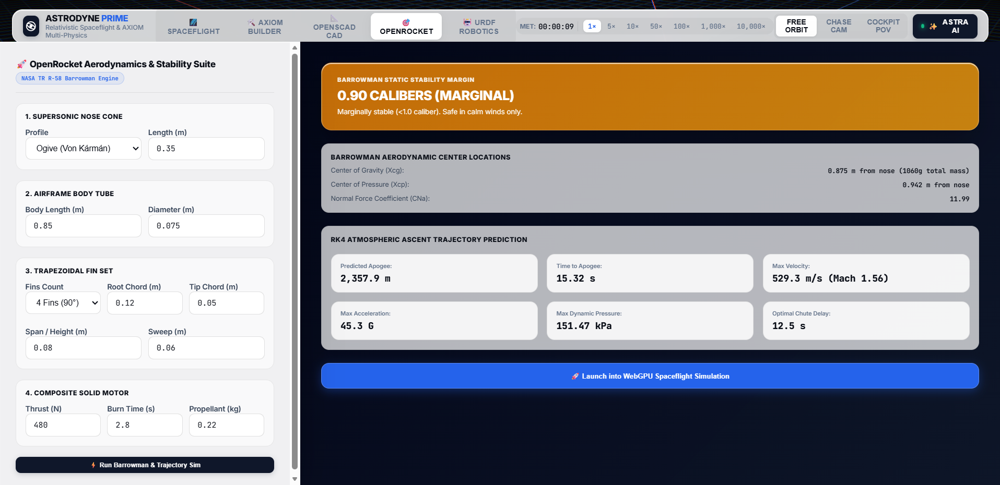
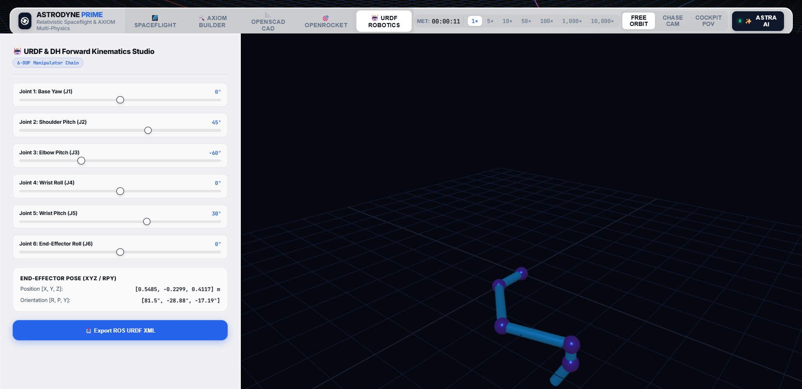
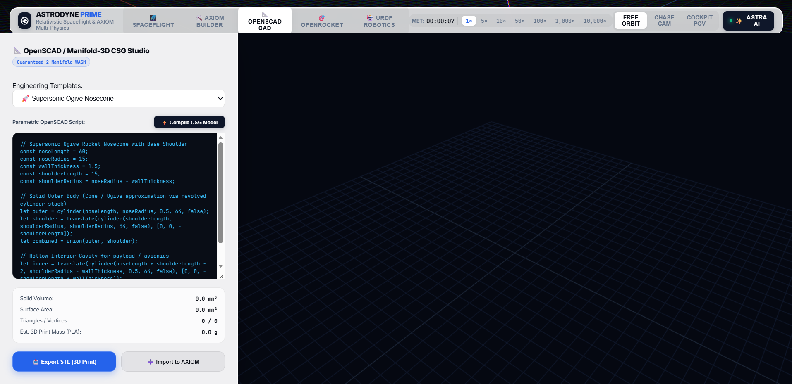
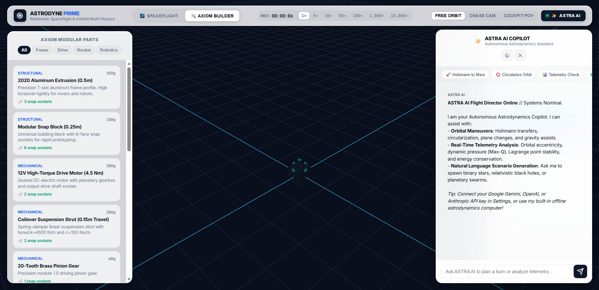
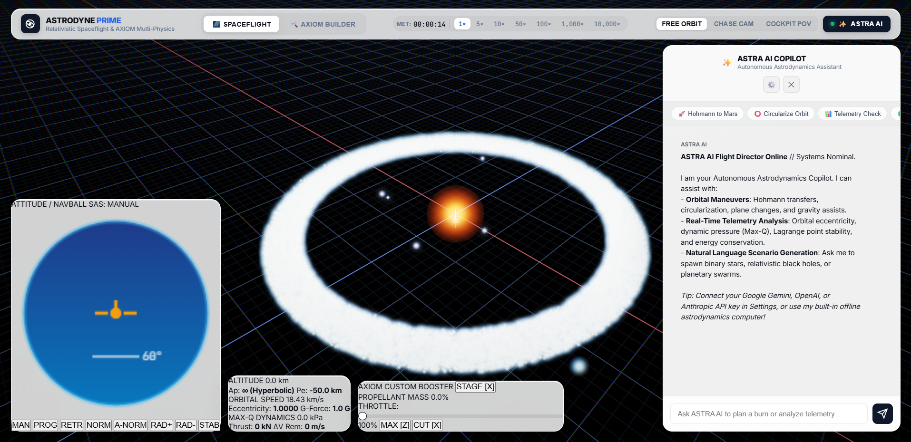

# ASTRODYNE PRIME & AXIOM Multi-Physics Engineering Hub

[](https://www.w3.org/TR/webgpu/)
[](https://www.typescriptlang.org/)
[](https://vitejs.dev/)
[](https://github.com/elalish/manifold)
[](https://openrocket.info/)
[](http://wiki.ros.org/urdf)
[](https://ai.google.dev/)
[](https://opensource.org/licenses/MIT)

> **All-In-One Unified Computational Physics & Open-Source Engineering Simulation Hub.**
> Synthesize rockets, rovers, multi-link robotic arms, parametric 3D-printable CAD solids, and aerodynamic airframes inside 5 deeply integrated open-source engineering suites, powered by WebGPU, WASM Rapier3D, Manifold-3D CSG, Barrowman Aerodynamics, and an autonomous AI Chief Architect (**ASTRA AI**).

---

## 🌌 The 5 Integrated Engineering Studios

```
╔══════════════════════════════════════════════════════════════════════════════════════════════════╗
║                                 ASTRODYNE PRIME MULTI-PHYSICS HUB                                 ║
╠═════════════════╦═════════════════╦══════════════════╦═══════════════════╦═══════════════════════╣
║ 🚀 SPACEFLIGHT  ║ 🛠️ AXIOM BUILD  ║ 📐 OPENSCAD CAD  ║ 🎯 OPENROCKET AERO║ 🤖 URDF ROBOTICS      ║
╠═════════════════╬═════════════════╬══════════════════╬═══════════════════╬═══════════════════════╣
║ • WebGPU N-Body ║ • Modular DAG   ║ • Manifold CSG   ║ • Barrowman TRR-58║ • 6-DOF Serial Chains ║
║ • Symplectic RK4║ • Rapier3D WASM ║ • Boolean Ops    ║ • Xcp vs Xcg Calib║ • DH Forward Kinemat. ║
║ • 6-DoF Cockpit ║ • Motor Curves  ║ • Mass/Vol Diag  ║ • RK4 Ascent Sim  ║ • Joint Angle Sliders ║
║ • Orbital Lines ║ • Gear Ratios   ║ • STL 3D Export  ║ • Launch to Space ║ • ROS URDF XML Export ║
╚═════════════════╩═════════════════╩══════════════════╩═══════════════════╩═══════════════════════╝
```

---

## 📸 Real Engine Visuals (100% Captured Live from WebGPU & CDP)

| 🎯 OpenRocket Aerodynamics & Barrowman Stability Lab | 🤖 URDF 6-DOF Robotics & DH Forward Kinematics Studio |
|:---:|:---:|
|  |  |

| 📐 OpenSCAD & Manifold-3D Parametric CAD Studio | 🛠️ AXIOM Modular Machine & Vehicle Builder |
|:---:|:---:|
|  |  |

| 🚀 6-DoF Spaceflight Flight Deck & 3D NavBall | ⚙️ 2026 Frontier AI Model Settings (Gemini 3.7 / Opus 5 / GPT-5.6) |
|:---:|:---:|
|  |  |

---

## 🔬 Deep Technical Specifications

### 1. 📐 OpenSCAD / Manifold-3D WASM Parametric CAD Engine
- **Guaranteed 2-Manifold Topologies**: Powered by WASM-compiled `manifold-3d`, ensuring self-intersection-free polygon meshes suitable for direct slicing and 3D printing.
- **Parametric CSG Primitives & Boolean Algebra**:
  - Primitives: `cube([x,y,z], center)`, `cylinder(h, r1, r2, fn, center)`, `sphere(r, fn)`.
  - CSG Operations: $	ext{union}(A, B)$, $	ext{difference}(A, B)$, $	ext{intersection}(A, B)$.
  - Affine Transforms: $	ext{translate}([x,y,z])$, $	ext{rotate}([rx, ry, rz])$, $	ext{scale}([sx, sy, sz])$.
- **Physical Diagnostics & Mass Estimation**:
  $$V = \iiint_{\Omega} dV, \quad A = \iint_{\partial\Omega} dA, \quad m_{	ext{PLA}} = V \cdot 
ho_{	ext{PLA}} \quad (
ho_{	ext{PLA}} = 1.24	ext{ g/cm}^3)$$
- **Export & Cross-Hub Import**:
  - `📥 Export STL`: ASCII & Binary Stereolithography output ready for Bambu Studio, PrusaSlicer, or Cura.
  - `➕ Import to AXIOM`: Converts custom CAD geometry directly into a physical simulation component in the AXIOM modular part graph.

---

### 2. 🎯 OpenRocket Aerodynamics & Flight Dynamics Suite (NASA TR R-58)
- **Barrowman Aerodynamic Method**: Exact closed-form formulation for Center of Pressure ($X_{cp}$) and Normal Force Coefficient ($C_{Na}$):
  - **Nose Cone**: $(C_{Na})_N = 2.0, \quad X_N = 0.466 \cdot L_N 	ext{ (Ogive)}$
  - **Trapezoidal Fin Set**:
    $$(C_{Na})_F = rac{4 N \left(rac{S}{D}
ight)^2}{1 + \sqrt{1 + \left(rac{2 L_F}{C_R + C_T}
ight)^2}} \cdot \left[1 + rac{R}{S + R}
ight]$$
    $$X_F = X_B + rac{X_R}{3} rac{C_R + 2 C_T}{C_R + C_T} + rac{1}{6}\left(C_R + C_T - rac{C_R C_T}{C_R + C_T}
ight)$$
- **Static Stability Margin**:
  $$\sigma = rac{X_{cp} - X_{cg}}{D} \quad [	ext{Calibers}]$$
  - $\sigma \in [1.0, 2.0]$: 🟢 **Optimal Stability**
  - $\sigma \in [0.0, 1.0]$: 🟡 **Marginal Stability**
  - $\sigma > 2.5$: 🔵 **Overstable (Weathercocking Risk)**
  - $\sigma < 0.0$: 🔴 **Unstable (Tumbling Hazard)**
- **4th-Order Runge-Kutta (RK4) Atmospheric Ascent Trajectory**:
  $$rac{d^2 h}{dt^2} = rac{F_{	ext{thrust}}(t) - rac{1}{2} 
ho(h) v^2 C_d(M) A}{m(t)} - g(h)$$
  - Evaluates Mach-dependent wave drag $C_d(M)$, dynamic pressure $Q(t) = rac{1}{2} 
ho v^2$, apogee ($m$), time to apogee ($s$), max G-force, and optimal parachute ejection delay ($t_{	ext{opt}}$).
  - `🚀 Launch into WebGPU Spaceflight`: Instantly transitions the simulated rocket into active orbital flight.

---

### 3. 🤖 URDF Robotics & Denavit-Hartenberg (DH) Kinematics Studio
- **Denavit-Hartenberg Forward Kinematics ($T_i^{i-1}$)**:
  $$A_i = egin{bmatrix} \cos	heta_i & -\sin	heta_i \coslpha_i & \sin	heta_i \sinlpha_i & a_i \cos	heta_i \ \sin	heta_i & \cos	heta_i \coslpha_i & -\cos	heta_i \sinlpha_i & a_i \sin	heta_i \ 0 & \sinlpha_i & \coslpha_i & d_i \ 0 & 0 & 0 & 1 \end{bmatrix}$$
  $$T_0^n = A_1 \cdot A_2 \cdots A_n$$
- **Real-Time 6-DOF Manipulator Visualizer**: Interactive joint angle sliders ($	heta_1 	o 	heta_6$) updating 3D articulated meshes and live End-Effector Cartesian pose $[X, Y, Z]$ and Euler angles $[	ext{Roll}, 	ext{Pitch}, 	ext{Yaw}]$.
- **ROS Standard URDF Export**: Emits complete `<robot>`, `<link>`, `<joint>`, `<inertial>`, `<visual>`, and `<collision>` XML files compatible with ROS 2, Gazebo, and MoveIt.

---

### 4. 🛠️ AXIOM Modular Machine & Vehicle Builder
- **DAG Assembly Graph**: Multi-socket mechanical tree with snap points (Cylindrical axial, Flange coupler, Hex bolt, Hinge servo, Ball socket).
- **Rapier3D WASM Multibody Physics**:
  - DC Motor Linear Torque-Speed Curve: $	au(\omega) = 	au_{	ext{stall}} \left(1 - rac{\omega}{\omega_{	ext{free}}}
ight)$
  - Spur Gear Ratio & Efficiency: $i = rac{N_2}{N_1}, \quad 	au_2 = 	au_1 \cdot i \cdot \eta$
  - Open Differential 50/50 Torque Split: $	au_L = 	au_R = rac{1}{2} 	au_{	ext{in}}$
- **Trailmakers-Style Live Drivetrain & Kinematics Test Mode**: Real-time `<W>`, `<a>`, `<s>`, `<D>` ground rover drive test directly in the builder viewport.

---

### 5. 🚀 WebGPU Spaceflight & Relativistic N-Body Simulation
- **Barnes-Hut $O(N \log N)$ Octree & Multipole Expansions**:
  $$\mathbf{F}_i = G m_i \sum_{j 
e i} rac{m_j (\mathbf{r}_j - \mathbf{r}_i)}{\left(\|\mathbf{r}_j - \mathbf{r}_i\|^2 + \epsilon^2
ight)^{3/2}} \left(1 + rac{3 G M}{c^2 r}
ight)$$
- **Tsiolkovsky Multi-Stage Propulsion**:
  $$\Delta v = I_{	ext{sp}} g_0 \ln\left(rac{m_0}{m_f}
ight), \quad \dot{m} = rac{F_{	ext{thrust}}}{I_{	ext{sp}} g_0}$$
- **Full 6-DoF Cockpit**: 3D NavBall HUD, Prograde/Retrograde/Normal/Radial autopilot SAS locking, time warp (1x to 10,000x), and Keplerian orbit prediction splines.

---

## ⚡ Quick Start

```bash
# 1. Clone the repository
git clone https://github.com/blah-blah-cell/astrodyne-prime.git
cd astrodyne-prime

# 2. Install dependencies (WebGPU, Three.js, Rapier3D, Manifold-3D)
npm install

# 3. Run all test suites (22 unit & integration tests)
npx tsx tests/test_all_engineering_hubs.ts

# 4. Start high-performance development server
npm run dev

# 5. Build optimized production bundle
npm run build
```

---

## 📜 License

MIT License. Designed and engineered for high-performance multi-physics simulation, open-source aerospace research, robotics engineering, and computational astrophysics.
